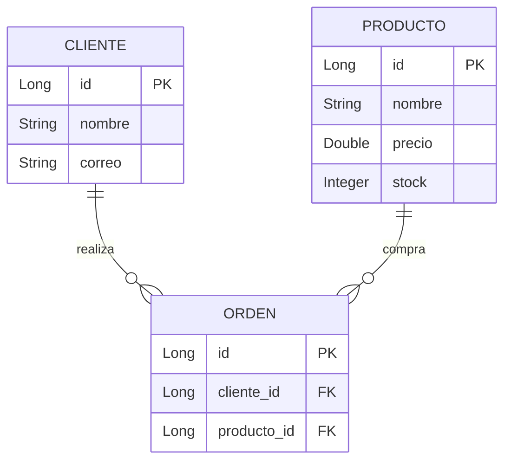

# 📘 Gestión de Órdenes con JPA y Spring Boot

Este proyecto es una **aplicación de ejemplo** construida con **Spring Boot** y **JPA (Java Persistence API)**, diseñada especialmente para personas que están empezando a trabajar con bases de datos en Java.

---

## 🧩 ¿Qué aprenderás con este proyecto?

- Cómo modelar una base de datos usando entidades en Java.
- Cómo usar JPA para crear relaciones entre entidades (`@ManyToOne`).
- Cómo realizar operaciones básicas como guardar, listar y probar datos usando `@DataJpaTest`.
- Cómo entender y representar las relaciones en un diagrama.

---

## 🏗️ Estructura de las entidades

Este proyecto contiene **3 entidades principales**:

### 1. `Cliente`
Representa una persona que realiza una orden.

```java
@Entity
public class Cliente {
    @Id
    @GeneratedValue(strategy = GenerationType.IDENTITY)
    private Long id;
    private String nombre;
    private String correo;
}
```

---

### 2. `Producto`
Representa un producto disponible para ordenar.

```java
@Entity
public class Producto {
    @Id
    @GeneratedValue(strategy = GenerationType.IDENTITY)
    private Long id;
    private String nombre;
    private Double precio;
    private Integer stock;
}
```

---

### 3. `Orden`
Representa una orden que contiene:
- un cliente (quién compra),
- un producto (qué se compra).

```java
@Entity
public class Orden {
    @Id
    @GeneratedValue(strategy = GenerationType.IDENTITY)
    private Long id;

    @ManyToOne
    @JoinColumn(name = "cliente_id")
    private Cliente cliente;

    @ManyToOne
    @JoinColumn(name = "producto_id")
    private Producto producto;
}
```

---

## 🔄 Relaciones entre entidades

- Un **cliente puede realizar muchas órdenes**.
- Un **producto puede estar en muchas órdenes**.
- Pero **cada orden pertenece a un único cliente y tiene un único producto**.

---

## 🔍 Diagrama Entidad-Relación (ER)



---

## 🧪 Pruebas con `@DataJpaTest`

El archivo `OrdenTest.java` valida que las relaciones y operaciones básicas funcionan correctamente.

### ✅ ¿Qué se prueba?

1. **Crear un cliente y un producto.**
2. **Guardar una orden que relacione ambos.**
3. **Verificar que la orden fue guardada correctamente.**
4. **Listar todas las órdenes y verificar sus relaciones.**

### Fragmento de prueba:

```java
Orden orden = new Orden();
orden.setCliente(cliente);
orden.setProducto(producto);
ordenRepository.save(orden);

assertThat(orden.getId()).isNotNull();
assertThat(orden.getCliente()).isEqualTo(cliente);
assertThat(orden.getProducto()).isEqualTo(producto);
```

---

## ⚙️ Requisitos para correr el proyecto

- Java 17 o superior
- Maven
- IDE como IntelliJ o Spring Tool Suite
- Dependencias de Spring Boot:
  - spring-boot-starter-data-jpa
  - spring-boot-starter-test
  - h2 (base de datos en memoria para pruebas)

---

## 💡 Recomendaciones para seguir aprendiendo

- Aprende sobre relaciones `@OneToMany` y `@ManyToMany`.
- Agrega una entidad `DetalleOrden` para manejar múltiples productos por orden.

---
