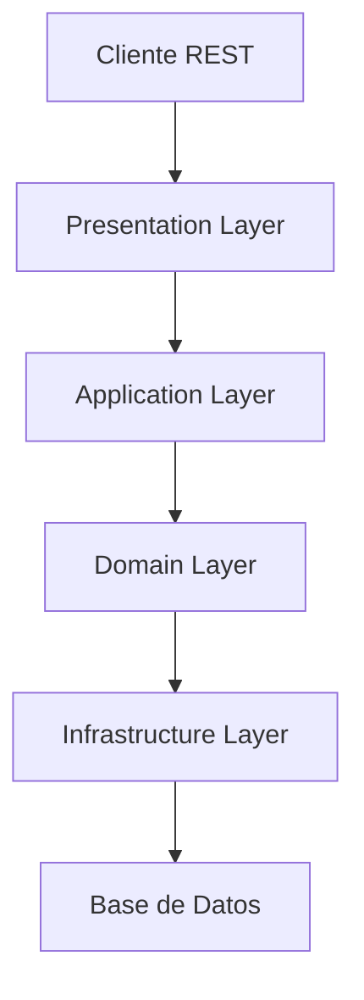
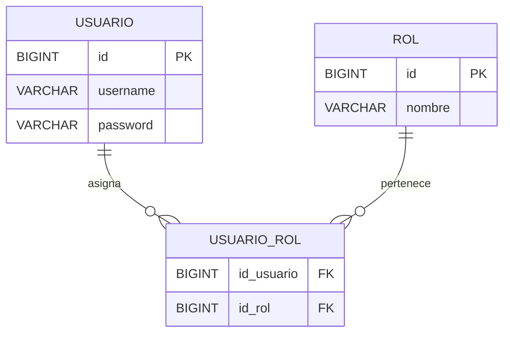
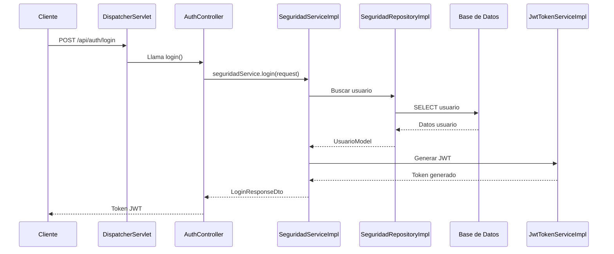
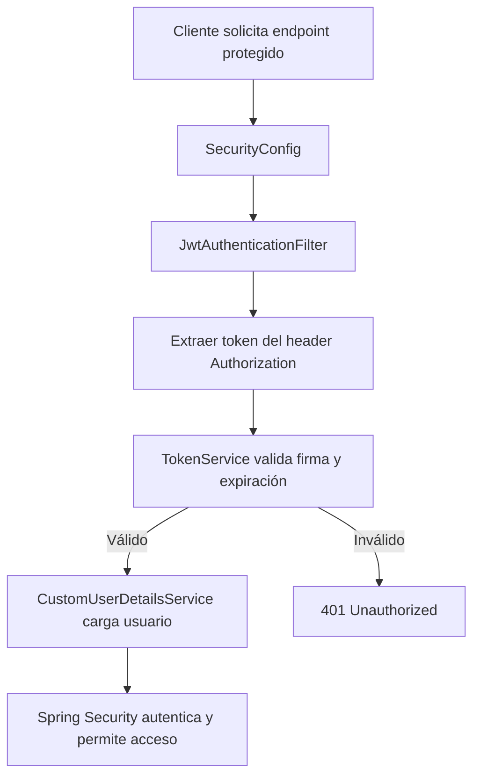

# 🔐 Autenticación con Spring Boot, Spring Web MVC y JWT

> **Aplicación educativa** para aprender a implementar autenticación y autorización sin estado (*stateless*) usando **Spring Boot**, **Spring Web MVC**, **Spring Security** y **JWT**.

---

## 🎯 Objetivos de aprendizaje

Al finalizar este proyecto, el alumno será capaz de:

| Concepto | Descripción | Beneficio |
|----------|-------------|-----------|
| **Spring Web MVC** | Patrón Modelo-Vista-Controlador en Spring | Entender el flujo de peticiones HTTP |
| **Arquitectura en capas** | Separación de presentación, aplicación, dominio e infraestructura | Código mantenible y escalable |
| **Spring Security** | Framework de autenticación y autorización | Proteger endpoints y controlar acceso |
| **JWT (JSON Web Token)** | Token seguro para identificar usuarios | Sesiones sin estado y escalabilidad |
| **Filtros de seguridad** | Interceptar y validar peticiones antes del controlador | Seguridad centralizada y reusable |

---

## 🏗 Arquitectura del proyecto

```
src/main/java/
└── pe/cibertec/desarrollo_aplicaciones_web_1/
    ├── application/
    │   └── seguridad/              # Lógica de casos de uso
    ├── domain/
    │   └── seguridad/              # Modelos y contratos de negocio
    ├── infrastructure/
    │   ├── configuration/seguridad # Configuración de seguridad y filtros
    │   └── seguridad/              # Entidades JPA y repositorios
    └── presentation/
        ├── controller/              # Controladores REST
        └── dto/                     # Objetos de transferencia de datos
```

### 📊 Diagrama de capas


---

## 📊 Modelo de datos

El sistema utiliza un modelo **muchos a muchos** entre usuarios y roles.



---

## 🗄 Script SQL — Creación de tablas y datos iniciales

```sql
CREATE TABLE usuario (
    id BIGINT PRIMARY KEY AUTO_INCREMENT,
    username VARCHAR(50) NOT NULL UNIQUE,
    password VARCHAR(255) NOT NULL
);

CREATE TABLE rol (
    id BIGINT PRIMARY KEY AUTO_INCREMENT,
    nombre VARCHAR(50) NOT NULL UNIQUE
);

CREATE TABLE usuario_rol (
    id_usuario BIGINT NOT NULL,
    id_rol BIGINT NOT NULL,
    PRIMARY KEY (id_usuario, id_rol),
    FOREIGN KEY (id_usuario) REFERENCES usuario(id) ON DELETE CASCADE,
    FOREIGN KEY (id_rol) REFERENCES rol(id) ON DELETE CASCADE
);

-- Datos iniciales
INSERT INTO usuario (username, password) VALUES
('admin', '$2a$10$hash_bcrypt_admin'),
('user', '$2a$10$hash_bcrypt_user');

INSERT INTO rol (nombre) VALUES ('ROLE_ADMIN'), ('ROLE_USER');

INSERT INTO usuario_rol (id_usuario, id_rol) VALUES
(1, 1),
(2, 2);
```

💡 **Nota:** Las contraseñas deben estar encriptadas con **BCrypt**.

---

## ⚙️ Configuración del proyecto

### 📦 Dependencias principales en `pom.xml`
- `spring-boot-starter-web` → Controladores REST y MVC
- `spring-boot-starter-security` → Seguridad y autenticación
- `spring-boot-starter-data-jpa` → Persistencia con JPA/Hibernate
- `jjwt-api`, `jjwt-impl`, `jjwt-jackson` → Manejo de JWT
- `mysql-connector-java` → Conexión a MySQL
- `lombok` → Reducción de código repetitivo

### 🛠 Configuración en `application.yml`
```yaml
server:
  port: 8080

spring:
  datasource:
    url: jdbc:mysql://localhost:3306/seguridad_db?createDatabaseIfNotExist=true&useSSL=false&serverTimezone=UTC
    username: root
    password: 1234
  jpa:
    hibernate:
      ddl-auto: update
    show-sql: true
    properties:
      hibernate:
        format_sql: true

security:
  jwt:
    secret: Y2xhdmUtbXktc2VjcmV0YS1lbS1iYXNlNjQ=   # Clave Base64
    expiration: 3600000  # 1 hora
```

---

## 🔄 Ciclo de vida de una petición



---

## 🔐 Flujo de seguridad con JWT



---

## 📂 Documentación clase por clase

### AuthController.java
Controlador REST que recibe las credenciales del usuario, las envía al servicio de seguridad y retorna un JWT si son válidas.

### SeguridadServiceImpl.java
Servicio que valida las credenciales consultando el repositorio y, si son correctas, genera un JWT mediante `TokenService`.

### SecurityConfig.java
Clase de configuración de Spring Security que define las rutas públicas y protegidas, y añade el filtro `JwtAuthenticationFilter`.

### JwtAuthenticationFilter.java
Filtro que intercepta las solicitudes, extrae el token JWT del header `Authorization`, lo valida y autentica al usuario.

### JwtTokenServiceImpl.java
Servicio que implementa la generación, validación y extracción de datos de un JWT usando la librería `io.jsonwebtoken`.

### CustomUserDetailsService.java
Carga el usuario desde la base de datos y adapta sus roles a autoridades que entiende Spring Security.

### Entidades JPA
- `UsuarioEntity`: Representa la tabla `usuario` con relación muchos a muchos hacia `RolEntity`.
- `RolEntity`: Representa la tabla `rol`.

### UsuarioRepositoryJpa.java
Repositorio JPA que permite consultar usuarios por su `username`.

---

## 🧪 Pruebas con Postman

1. **Login**
   - Método: POST
   - URL: `http://localhost:8080/api/auth/login`
   - Body:
     ```json
     {
       "username": "admin",
       "password": "1234"
     }
     ```
   - Respuesta: JWT.

2. **Acceso protegido**
   - Método: GET
   - URL: `http://localhost:8080/api/usuarios`
   - Header: `Authorization: Bearer <token>`

3. **Token inválido**
   - Respuesta: 401 Unauthorized.

---

## 📈 Próximos pasos

| Ejercicio | Descripción |
|-----------|-------------|
| Registro de usuarios | Crear endpoint `POST /api/auth/register` |
| Refresh token | Implementar renovación de tokens |
| Roles avanzados | Crear más roles y proteger endpoints específicos |
| Validaciones | Usar `@Valid` en DTOs |

---

## 📚 Recursos recomendados

- [Spring Security Docs](https://spring.io/projects/spring-security)
- [JWT.io](https://jwt.io/)
- [Baeldung - Spring Security](https://www.baeldung.com/tag/spring-security/)

