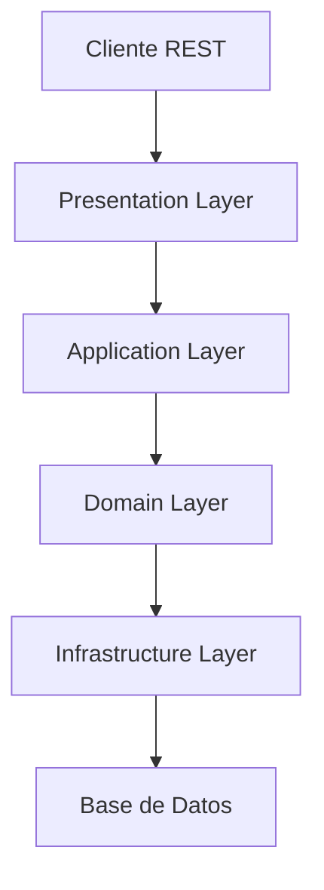
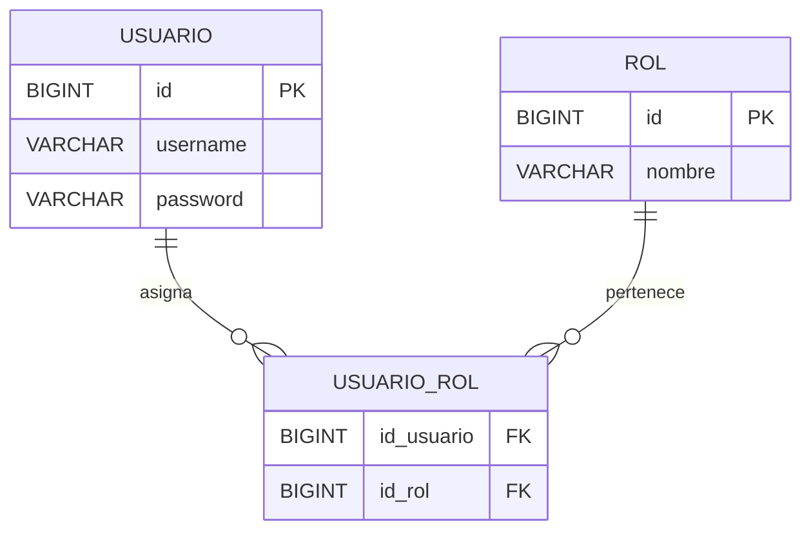
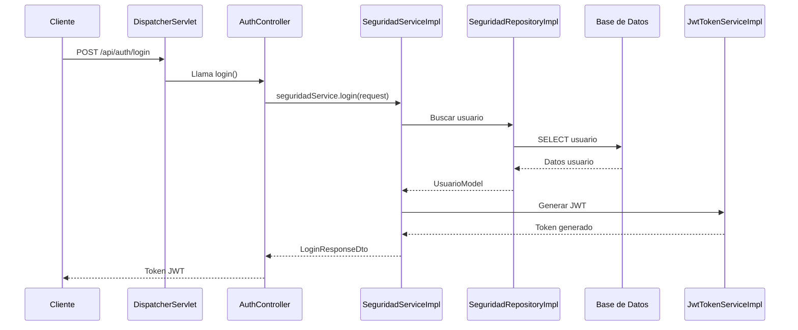
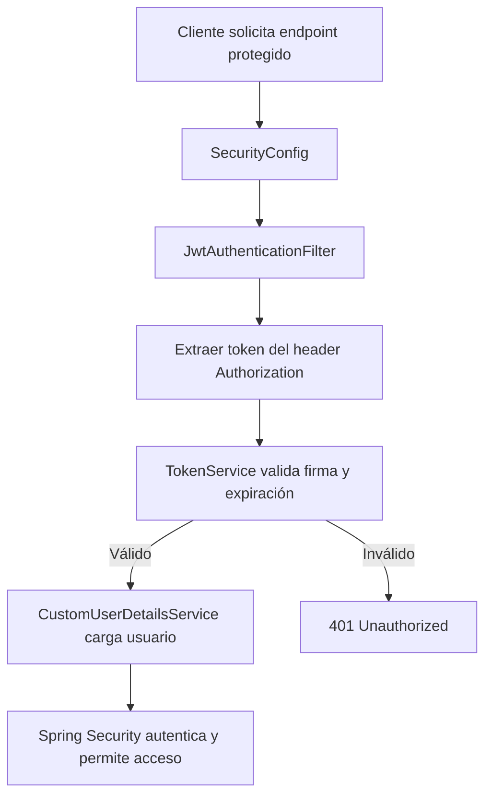

# 🔐 Autenticación con Spring Boot, Spring Web MVC y JWT

> **Aplicación educativa** para aprender a implementar autenticación y autorización sin estado (*stateless*) usando **Spring Boot**, **Spring Web MVC**, **Spring Security** y **JWT**.

---

## 🎯 Objetivos de aprendizaje

Al finalizar este proyecto, el alumno será capaz de:

| Concepto | Descripción | Beneficio |
|----------|-------------|-----------|
| **Spring Web MVC** | Patrón Modelo-Vista-Controlador en Spring | Entender el flujo de peticiones HTTP |
| **Arquitectura en capas** | Separación de presentación, aplicación, dominio e infraestructura | Código mantenible y escalable |
| **Spring Security** | Framework de autenticación y autorización | Proteger endpoints y controlar acceso |
| **JWT (JSON Web Token)** | Token seguro para identificar usuarios | Sesiones sin estado y escalabilidad |
| **Filtros de seguridad** | Interceptar y validar peticiones antes del controlador | Seguridad centralizada y reusable |

---

## 🧰 Requisitos
- JDK 17 o superior
- Maven 3.9+ (o usar el wrapper `mvnw.cmd` en Windows)
- MySQL 8.x en localhost

## 🚀 Cómo ejecutar
1. Configura la contraseña de MySQL como variable de entorno para que `${password}` se resuelva:
   - Windows PowerShell:
     ```powershell
     setx password "TU_PASSWORD"
     ```
   - O reemplaza `${password}` directamente en `src/main/resources/application.yml` (no recomendado para producción).
2. Crea la base de datos si no existe (opcional, JPA puede crear tablas):
   ```sql
   CREATE DATABASE rrhh_system CHARACTER SET utf8mb4 COLLATE utf8mb4_unicode_ci;
   ```
3. Construye y ejecuta la aplicación:
   - Compilar pruebas: `mvnw.cmd -q -DskipTests package`
   - Ejecutar: `mvnw.cmd spring-boot:run`
4. Endpoints públicos disponibles:
   - `POST /public/api/auth/login`
   - `POST /public/api/auth/refresh`

## 🏗 Arquitectura del proyecto

```
src/main/java/
└── pe/cibertec/desarrollo_aplicaciones_web_1/
    ├── application/
    │   └── seguridad/              # Lógica de casos de uso
    ├── domain/
    │   └── seguridad/              # Modelos y contratos de negocio
    ├── infrastructure/
    │   ├── configuration/seguridad # Configuración de seguridad y filtros
    │   └── seguridad/              # Entidades JPA y repositorios
    └── presentation/
        ├── controller/              # Controladores REST
        └── dto/                     # Objetos de transferencia de datos
```

### 📊 Diagrama de capas


---

## 📊 Modelo de datos

El sistema utiliza un modelo **muchos a muchos** entre usuarios y roles.



---

## 🗄 Script SQL — Esquema opcional (si no usas DDL automático de JPA)

```sql
CREATE TABLE IF NOT EXISTS usuarios (
    id BIGINT PRIMARY KEY AUTO_INCREMENT,
    username VARCHAR(50) NOT NULL UNIQUE,
    email VARCHAR(120),
    password_hash VARCHAR(255) NOT NULL,
    nombre VARCHAR(80),
    apellido VARCHAR(80),
    activo TINYINT(1) DEFAULT 1
);

CREATE TABLE IF NOT EXISTS roles (
    id BIGINT PRIMARY KEY AUTO_INCREMENT,
    nombre VARCHAR(50) NOT NULL UNIQUE,
    descripcion VARCHAR(200),
    activo TINYINT(1) DEFAULT 1
);

CREATE TABLE IF NOT EXISTS usuario_roles (
    id BIGINT PRIMARY KEY AUTO_INCREMENT,
    usuario_id BIGINT NOT NULL,
    rol_id BIGINT NOT NULL,
    activo TINYINT(1) DEFAULT 1,
    CONSTRAINT fk_usuario FOREIGN KEY (usuario_id) REFERENCES usuarios(id) ON DELETE CASCADE,
    CONSTRAINT fk_rol FOREIGN KEY (rol_id) REFERENCES roles(id) ON DELETE CASCADE
);

-- Datos iniciales de ejemplo (ajusta el hash a tu contraseña real)
INSERT INTO roles (nombre, descripcion) VALUES ('ROLE_ADMIN', 'Administrador'), ('ROLE_USER', 'Usuario estándar');

INSERT INTO usuarios (username, email, password_hash, nombre, apellido, activo) VALUES
('admin', 'admin@local', '$2a$10$hash_bcrypt_admin', 'Admin', 'Local', 1),
('user', 'user@local', '$2a$10$hash_bcrypt_user', 'User', 'Local', 1);

INSERT INTO usuario_roles (usuario_id, rol_id, activo) VALUES
(1, 1, 1),
(2, 2, 1);
```

💡 Notas:
- Las contraseñas deben estar encriptadas con BCrypt.
- Si dejas que JPA genere el esquema, este script es opcional.

---

## ⚙️ Configuración del proyecto

### 📦 Dependencias principales en `pom.xml`
- `spring-boot-starter-web` → Controladores REST y MVC
- `spring-boot-starter-security` → Seguridad y autenticación
- `spring-boot-starter-data-jpa` → Persistencia con JPA/Hibernate
- `jjwt-api`, `jjwt-impl`, `jjwt-jackson` → Manejo de JWT
- `mysql-connector-java` → Conexión a MySQL
- `lombok` → Reducción de código repetitivo

### 🛠 Configuración en `application.yml`
```yaml
spring:
  datasource:
    url: jdbc:mysql://localhost:3306/rrhh_system?serverTimezone=America/Lima&allowPublicKeyRetrieval=true&useSSL=false
    driver-class-name: com.mysql.cj.jdbc.Driver
    username: root
    password: ${password}
    hikari:
      maximum-pool-size: 10
      minimum-idle: 5
      idle-timeout: 600000
      max-lifetime: 1800000
      connection-timeout: 30000
  jpa:
    database-platform: org.hibernate.dialect.MySQL8Dialect
    show-sql: true

security:
  jwt:
    secret: TDSZydxbpLTzBiSyAdfK6qzd8nBt9WeOFBO-Pi7NO5X1IWgLA594XmYEj99lEK_ZEyKKs2dkmIe8g1dFBYuQJg
    access-token-expiration: 900000   # 15 minutos en milisegundos
    refresh-token-expiration: 900000  # 15 minutos en milisegundos
```

---

## 🔄 Ciclo de vida de una petición



---

## 🔐 Flujo de seguridad con JWT



---

## 📂 Documentación clase por clase

### AuthController.java
Controlador REST que recibe las credenciales del usuario, las envía al servicio de seguridad y retorna un JWT si son válidas.

### SeguridadServiceImpl.java
Servicio que valida las credenciales consultando el repositorio y, si son correctas, genera un JWT mediante `TokenService`.

### SecurityConfig.java
Clase de configuración de Spring Security que define las rutas públicas y protegidas, y añade el filtro `JwtAuthenticationFilter`.

### JwtAuthenticationFilter.java
Filtro que intercepta las solicitudes, extrae el token JWT del header `Authorization`, lo valida y autentica al usuario.

### JwtTokenServiceImpl.java
Servicio que implementa la generación, validación y extracción de datos de un JWT usando la librería `io.jsonwebtoken`.

### CustomUserDetailsService.java
Carga el usuario desde la base de datos y adapta sus roles a autoridades que entiende Spring Security.

### Entidades JPA
- `UsuarioEntity`: Representa la tabla `usuario` con relación muchos a muchos hacia `RolEntity`.
- `RolEntity`: Representa la tabla `rol`.

### UsuarioRepositoryJpa.java
Repositorio JPA que permite consultar usuarios por su `username`.

---

## 🧪 Pruebas con Postman y curl

1. Login
   - Método: POST
   - URL: `http://localhost:8080/public/api/auth/login`
   - Body (JSON):
     ```json
     {
       "username": "admin",
       "password": "1234"
     }
     ```
   - curl:
     ```bash
     curl -X POST "http://localhost:8080/public/api/auth/login" \
       -H "Content-Type: application/json" \
       -d '{"username":"admin","password":"1234"}'
     ```
   - Respuesta: `{ "accessToken": "...", "refreshToken": "...", "expiresIn": 900 }`

2. Refresh token
   - Método: POST
   - URL: `http://localhost:8080/public/api/auth/refresh`
   - Body (JSON):
     ```json
     {
       "refreshToken": "<tu_refresh_token>"
     }
     ```
   - curl:
     ```bash
     curl -X POST "http://localhost:8080/public/api/auth/refresh" \
       -H "Content-Type: application/json" \
       -d '{"refreshToken":"<tu_refresh_token>"}'
     ```
   - Respuesta: `{ "accessToken": "...", "refreshToken": "...", "expiresIn": 900 }`

3. Acceso a endpoints protegidos (ejemplo genérico)
   - Agrega `Authorization: Bearer <access_token>` a tus solicitudes
   - Si el token es inválido o expiró: 401 Unauthorized.

---

## 📂 Documentación clase por clase — Detallada por método (estándares de seguridad)

A continuación se detalla el propósito y comportamiento de cada clase y de sus métodos públicos más relevantes, incluyendo prácticas recomendadas de seguridad (alineadas con OWASP ASVS y buenas prácticas de JWT).

1) presentation/controller/AuthController
- login(LoginRequestDto request):
  - Qué hace: recibe credenciales (username, password), delega la autenticación a SeguridadService.autenticacion y devuelve accessToken, refreshToken y expiresIn.
  - Seguridad:
    - Usa @Valid para validar el DTO (añadir anotaciones en el DTO si aún no existen).
    - No registra contraseñas en logs. Evitar añadir logs con datos sensibles.
    - Respuestas coherentes: no revelar si el usuario existe; delega al servicio que uniformiza mensajes de error.
- refresh(RefreshTokenRequestDto request):
  - Qué hace: recibe refreshToken válido y obtiene un nuevo par de tokens; delega en SeguridadService.refrescar.
  - Seguridad:
    - Valida el refresh token y devuelve 401/400 ante token inválido/expirado (a través del servicio).
    - No expone datos del usuario en la respuesta más allá de los tokens.
- buildLoginResponse(String accessToken, String refreshToken):
  - Qué hace: construye el DTO de respuesta con TTL derivado de JwtProperties.
  - Seguridad: no incluir información sensible adicional en la respuesta.

2) infrastructure/configuration/seguridad/SecurityConfig
- authenticationManager(AuthenticationConfiguration):
  - Qué hace: expone AuthenticationManager gestionado por Spring.
  - Seguridad: usar proveedores por defecto de Spring con PasswordEncoder fuerte.
- passwordEncoder():
  - Qué hace: provee BCryptPasswordEncoder.
  - Seguridad: BCrypt con factor de costo adecuado (por defecto 10). Para producción, calibrar costo sin impactar SLO.
- securityFilterChain(HttpSecurity):
  - Qué hace: configura CORS, deshabilita CSRF (API stateless), sesión STATELESS, autoriza /public/** y protege el resto, e inyecta JwtAuthenticationFilter.
  - Seguridad:
    - CSRF deshabilitado sólo si no hay cookies de sesión. Para frontends con cookies, re-evaluar.
    - Definir políticas CORS estrictas en CorsConfigurationSource (orígenes, métodos, headers permitidos).
    - Asegurar orden del filtro antes de UsernamePasswordAuthenticationFilter (como está).

3) infrastructure/configuration/seguridad/JwtAuthenticationFilter
- doFilterInternal(HttpServletRequest, HttpServletResponse, FilterChain):
  - Qué hace: extrae Authorization: Bearer <token>, valida con TokenService, carga UserDetails y establece Authentication en el SecurityContext.
  - Seguridad:
    - Maneja token nulo/mal formateado continuando la cadena sin autenticar.
    - Evitar logs con el token completo. Mensajes genéricos ante errores (logger.warn actual es apropiado, pero no interpolar el token completo).
    - Garantiza que no reemplace Authentication ya existente (comprueba contexto nulo).

4) infrastructure/seguridad/service/JwtTokenServiceImpl (implementa domain.seguridad.service.TokenService)
- generarTokenAcceso(UsuarioModel usuario):
  - Qué hace: genera JWT con claims personalizados (name, roles), sujeto=username, issuedAt y exp según accessTokenExpiration, firma HMAC con clave de JwtProperties.
  - Seguridad:
    - La secret debe ser de longitud suficiente (>=256 bits para HS256) y mantenerse fuera del control de código (env/secret manager). En este proyecto se carga desde application.yml; en prod usar variables de entorno.
    - No incluir PII sensible como correo completo si no es necesario. Actualmente incluye name y roles (aceptable).
- generarTokenRefresco(UsuarioModel usuario):
  - Qué hace: emite refresh token con sólo subject y expiración de refresh.
  - Seguridad:
    - Mantener expiración más larga que access pero con rotación (el flujo actual emite nuevo refresh al refrescar, lo cual es rotación).
    - Considerar almacenar invalidaciones/blacklist en repositorio si se requiere revocación.
- extraerUsuario(String token):
  - Qué hace: retorna el subject (username) del JWT.
  - Seguridad: no asume validez; se debe llamar esTokenValido antes de usar el subject.
- esTokenValido(String token):
  - Qué hace: verifica firma y estructura; si falla, devuelve false.
  - Seguridad: valida expiración automáticamente (jjwt la valida al parsear claims). Maneja excepciones sin propagarlas.

5) infrastructure/seguridad/service/CustomUserDetailsService (UserDetailsService)
- loadUserByUsername(String username):
  - Qué hace: busca UsuarioModel por username vía dominio (UsuarioRepository) y lo adapta a UserDetails (CustomUserDetails). Lanza UsernameNotFoundException si no existe.
  - Seguridad: no revelar detalles de existencia del usuario hacia el cliente; Spring lo maneja con respuestas genéricas.

6) application/seguridad/SeguridadServiceImpl (domain.seguridad.service.SeguridadService)
- autenticacion(String username, String password):
  - Qué hace: delega a AutenticarUsuarioUseCase.ejecutar.
  - Seguridad: la autenticación se concentra en el use case con manejo de errores y logging controlado.
- refrescar(String refreshToken):
  - Qué hace: delega a RefrescarTokenUseCase.ejecutar.
  - Seguridad: rotación del refresh token al refrescar; importante para mitigar reutilización de tokens.

7) application/seguridad/usecase/AutenticarUsuarioUseCase
- ejecutar(String username, String password):
  - Qué hace: autentica con AuthenticationManager (que compara credenciales usando PasswordEncoder), y si es correcto, genera par de tokens.
  - Seguridad:
    - Atrapa excepciones y responde con mensaje genérico "Credenciales inválidas" (no filtra si falló user o password).
    - Log con nivel warn sin credenciales (ok). Evitar incluir el password en logs.
- generarTokensDesdeUsername(String username) [privado]:
  - Qué hace: carga usuario, y emite access/refresh tokens.
  - Seguridad: el contenido del JWT se limita a claims necesarios (name/roles). No incluye password ni PII sensible.

8) application/seguridad/usecase/RefrescarTokenUseCase
- ejecutar(String refreshToken):
  - Qué hace: valida refresh token; si es válido, extrae username y emite nuevo access y refresh (rotación de refresh).
  - Seguridad: rechaza refresh tokens inválidos/expirados con excepción de dominio.
- generarTokensDesdeUsername(String username) [privado]:
  - Qué hace: igual a AutenticarUsuarioUseCase pero para flujo de refresh.
  - Seguridad: rotación del refresh token y no exposición de datos sensibles.

9) infrastructure/seguridad/repository/SeguridadRepositoryImpl (implementa domain.seguridad.repository.UsuarioRepository)
- usuarioPorUserName(String username):
  - Qué hace: mapea UsuarioEntity + roles a UsuarioModel (incluye nombre, apellido, email, activo, roles) y retorna Optional.
  - Seguridad: passwordHash se expone sólo como password dentro del modelo para el motor de autenticación; nunca se devuelve al cliente.
- guardarToken(String token):
  - Qué hace: placeholder (log). En producción, debería persistir tokens (por ejemplo, jti) para listas de bloqueo/permitidos.
  - Seguridad: nunca registrar tokens completos en logs de producción; almacenar sólo hashes o jti.
- obtenerTokenCache(String username):
  - Qué hace: placeholder vacío. Podría usarse para un cache de tokens.
  - Seguridad: si se implementa, proteger almacenamiento y expiración.

10) infrastructure/configuration/seguridad/CustomUserDetails (UserDetails)
- getAuthorities():
  - Qué hace: convierte roles de dominio a GrantedAuthority con prefijo ROLE_.
  - Seguridad: usar prefijos coherentes con Spring para antMatchers/hasRole.
- getPassword(): retorna hash BCrypt del usuario.
- getUsername(): retorna el username.
- isEnabled(): usa el flag activo del usuario.
  - Seguridad: deshabilitar usuarios bloqueados/pendientes.

11) DTOs
- LoginRequestDto: debe contener username, password y validaciones @NotBlank/@Size. No loguear su contenido.
- RefreshTokenRequestDto: contiene refreshToken y validación @NotBlank. No loguear tokens.
- LoginResponseDto: transporta accessToken, refreshToken, expiresIn. Evitar añadir PII.

Checklist de seguridad recomendado
- JWT
  - Usar algoritmo HS256/HS512 con clave de >= 256 bits (ya se usa clave Base64URL robusta).
  - Establecer expiraciones cortas para access (actual: 15 min) y refresco con rotación (implementado).
  - Considerar incluir claims estándar: iss, aud si aplica; y jti para revocación.
- Autenticación/Autorización
  - Endpoints públicos bajo /public/**, resto autenticado (configurado).
  - Evaluar autorización por rol en endpoints protegidos via @PreAuthorize o config HTTP.
- Transporte/Headers
  - Requerir HTTPS en producción; rechazar tokens por HTTP plano.
  - Configurar CORS restrictivo.
- Errores/Logs
  - Mensajes genéricos para autenticación fallida.
  - No loguear credenciales ni tokens.
- Almacenamiento
  - Contraseñas con BCrypt (ya configurado). Rotación de secrets y gestión fuera del repositorio.

---

## 📈 Próximos pasos

| Ejercicio | Descripción |
|-----------|-------------|
| Registro de usuarios | Crear endpoint `POST /public/api/auth/register` |
| Refresh token | Ya implementado: `POST /public/api/auth/refresh` |
| Roles avanzados | Crear más roles y proteger endpoints específicos |
| Validaciones | Usar `@Valid` en DTOs |

---

## 📚 Recursos recomendados

- [Spring Security Docs](https://spring.io/projects/spring-security)
- [JWT.io](https://jwt.io/)
- [Baeldung - Spring Security](https://www.baeldung.com/tag/spring-security/)


