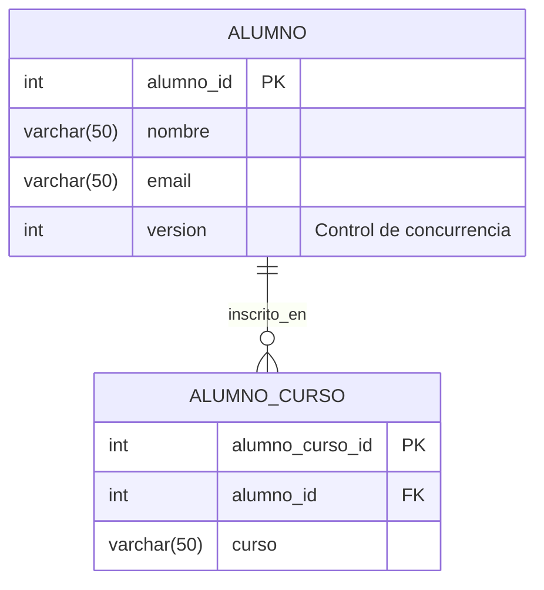

# 📘 Conceptos Avanzados de JPA con Spring Boot

> **Aplicación educativa** construida con **Spring Boot** y **JPA (Java Persistence API)** para dominar conceptos avanzados de persistencia de datos.

---

## 🎯 Objetivos de aprendizaje

Al finalizar este proyecto, dominarás los siguientes conceptos avanzados de JPA:

| Concepto | Descripción | Beneficio |
|----------|-------------|-----------|
| **Flushing** | Sincronización manual memoria ↔ BD | Control preciso de operaciones SQL |
| **Batching** | Agrupación de operaciones SQL | Mejora significativa del rendimiento |
| **Fetching** | Estrategias de carga de relaciones | Optimización de consultas |
| **Caching** | Sistema de caché multinivel | Reducción de consultas repetitivas |
| **Concurrencia** | Control de modificaciones simultáneas | Integridad de datos |

---

## 🏗️ Arquitectura del proyecto

```
src/main/java/
├── entity/
│   ├── Alumno.java           # Entidad principal
│   └── AlumnoCurso.java      # Entidad de relación
├── repository/
│   ├── AlumnoRepository.java
│   └── AlumnoCursoRepository.java
└── service/
    └── JpaAvanzadoService.java
```

### 📊 Modelo de datos



---

## ⚙️ Configuración del proyecto

### 🗄️ Base de datos

**Scripts de inicialización:**
```sql
-- Crear base de datos
CREATE DATABASE IF NOT EXISTS cibertec;
USE cibertec;

-- Crear tablas
CREATE TABLE alumno (
    alumno_id INT AUTO_INCREMENT PRIMARY KEY,
    nombre VARCHAR(50) NULL,
    email VARCHAR(50) NULL,
    version INT NULL
);

CREATE TABLE alumno_curso (
    alumno_curso_id INT AUTO_INCREMENT PRIMARY KEY,
    alumno_id INT NOT NULL,
    curso VARCHAR(50) NOT NULL,
    FOREIGN KEY (alumno_id) REFERENCES alumno(alumno_id)
);
```

### 📊 Pool de conexiones

**Fórmula para calcular conexiones óptimas: Connection Pool Sizing Formula**
```
Pool Óptimo = (Núcleos CPU × 2) + Discos HDD/SSD efectivos
Minimum Idle = Pool Máximo × 0.25
```

```bash
# Ver CPU
wmic cpu get NumberOfCores,NumberOfLogicalProcessors

# Ver RAM
wmic computersystem get TotalPhysicalMemory

# Ver discos
wmic diskdrive get model,size,interfacetype
```

**Ejemplo práctico:**
- Servidor: 6 núcleos CPU
- Discos: 1 HDD + 1 SSD = 2 discos efectivos
- Cálculo: Pool Óptimo = (6 × 2) + 2 = 14 conexiones

**Configuración recomendada:**
```yaml
spring:
  datasource:
    url: jdbc:mysql://localhost:3306/cibertec
    driver-class-name: com.mysql.cj.jdbc.Driver
    username: root
    password: 123456
    hikari:
      maximum-pool-size: 14         # Máximo de conexiones
      minimum-idle: 4               # Mínimo de conexiones inactivas
      idle-timeout: 600000          # 10 minutos
      max-lifetime: 1800000         # 30 minutos
      connection-timeout: 30000     # 30 segundos
```

### 🔧 Configuración JPA

```yaml
spring:
  jpa:
    database-platform: org.hibernate.dialect.MySQL8Dialect
    show-sql: true                  # Mostrar SQL en desarrollo
    properties:
      hibernate:
        jdbc:
          batch_size: 20
        order_inserts: true
        order_updates: true
        format_sql: true            # Formatear SQL para mejor legibilidad
```

---

## 📚 Conceptos avanzados explicados

### 1. 🔄 Flushing - Sincronización controlada

**¿Qué problema resuelve?** Controlar **cuándo** se ejecutan las operaciones SQL, sin esperar al commit de la transacción.

**Casos de uso:**
- ✅ Verificar errores de BD antes del commit
- ✅ Obtener IDs generados automáticamente
- ✅ Resolver dependencias entre operaciones

```java
// ❌ Problema: El INSERT no se ejecuta inmediatamente
Alumno alumno = new Alumno("Franklin", "franklin@ejemplo.com");
alumno = alumnoRepository.save(alumno); // Solo en memoria

// ✅ Solución: Forzar sincronización
entityManager.flush(); // Ejecuta INSERT en BD

// Verificar que está persistido
entityManager.clear(); // Limpiar caché
Alumno verificado = entityManager.find(Alumno.class, alumno.getAlumnoId());
```

### 2. ⚡ Batching - Operaciones en lote

**¿Qué problema resuelve?** Reduce el número de viajes a la BD agrupando operaciones similares.

**Impacto en rendimiento:**
- Sin batching: 25 inserciones = 25 viajes a BD
- Con batching: 25 inserciones = 2 viajes a BD (lotes de 20 + 5)

**Configuración recomendada:**
```yaml
spring:
  jpa:
    properties:
      hibernate:
        jdbc:
          batch_size: 20              # Tamaño del lote
        order_inserts: true           # Optimiza orden de inserción
        order_updates: true           # Optimiza orden de actualización
```

### 3. 📦 Fetching - Estrategias de carga

**¿Qué problema resuelve?** El temido **problema N+1** que genera consultas innecesarias.

| Estrategia | Cuándo usar | Ventajas | Desventajas |
|------------|-------------|----------|-------------|
| **LAZY** | Datos opcionales | Menor uso de memoria | Posible LazyInitializationException |
| **EAGER** | Datos siempre necesarios | Sin excepciones lazy | Mayor uso de memoria |
| **JOIN FETCH** | Optimizar consultas específicas | Elimina N+1 | Consultas más complejas |

**Ejemplo del problema N+1:**
```java
// ❌ Problema: 1 consulta principal + N consultas adicionales
List<AlumnoCurso> cursos = alumnoCursoRepository.findAll(); // 1 consulta
for (AlumnoCurso curso : cursos) {
    String nombre = curso.getAlumno().getNombre(); // N consultas adicionales
}

// ✅ Solución: JOIN FETCH
@Query("SELECT ac FROM AlumnoCurso ac JOIN FETCH ac.alumno")
List<AlumnoCurso> findAllWithAlumnos(); // Solo 1 consulta
```

### 4. 💾 Caching - Sistema de caché

**¿Qué problema resuelve?** Evita consultas repetitivas manteniendo entidades en memoria.

**Niveles de caché:**

```
🔄 Primer nivel (Session Cache)
├── Automático por EntityManager
├── Garantiza identidad de objetos
└── Duración: una transacción

🔄 Segundo nivel (SessionFactory Cache)
├── Compartido entre sesiones
├── Configurable por entidad
└── Duración: configurable
```

**Demostración práctica:**
```java
// Primera consulta → BD
Alumno consulta1 = entityManager.find(Alumno.class, 1L);

// Segunda consulta → CACHÉ (más rápida)
Alumno consulta2 = entityManager.find(Alumno.class, 1L);

// Verificar identidad
assert consulta1 == consulta2; // true - mismo objeto en memoria
```

### 5. 🔐 Control de concurrencia

**¿Qué problema resuelve?** Previene pérdida de datos cuando múltiples usuarios modifican la misma entidad.

**Estrategias disponibles:**

| Tipo | Implementación | Cuándo usar |
|------|---------------|-------------|
| **Optimista** | `@Version` | Lecturas frecuentes, escrituras ocasionales |
| **Pesimista** | Locks | Escrituras frecuentes, conflictos esperados |

**Flujo de control optimista:**
```java
// 1. Dos usuarios obtienen la misma entidad (versión = 1)
Alumno usuario1 = entityManager.find(Alumno.class, 1L);
Alumno usuario2 = entityManager.find(Alumno.class, 1L);

// 2. Usuario 1 modifica primero (versión → 2)
usuario1.setNombre("Modificado por Usuario 1");
entityManager.merge(usuario1); // ✅ Éxito

// 3. Usuario 2 intenta modificar (versión aún = 1)
usuario2.setNombre("Modificado por Usuario 2");
entityManager.merge(usuario2); // ❌ OptimisticLockException
```

---

## 📈 Próximos pasos

### 🔬 Experimentos sugeridos

- [ ] Modificar `batch_size` y medir impacto en rendimiento
- [ ] Comparar diferentes estrategias de fetching
- [ ] Implementar caché de segundo nivel
- [ ] Probar control de concurrencia pesimista
- [ ] Analizar planes de ejecución SQL

### 📚 Recursos para profundizar

| Recurso | Descripción | Nivel |
|---------|-------------|-------|
| [JPA Specification](https://jakarta.ee/specifications/persistence/) | Documentación oficial | Intermedio |
| [Hibernate Documentation](https://hibernate.org/orm/documentation/) | Guía completa de Hibernate | Intermedio |
| [Spring Data JPA](https://docs.spring.io/spring-data/jpa/docs/current/reference/html/) | Referencia de Spring Data | Básico |
| [High-Performance Java Persistence](https://vladmihalcea.com/books/high-performance-java-persistence/) | Libro especializado | Avanzado |

---